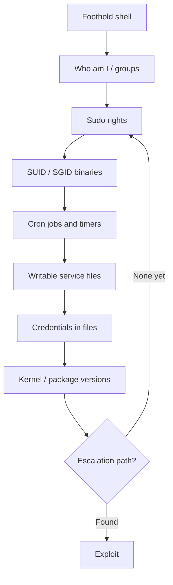

Privilege escalation is a search problem, not a magic trick. The box already
contains the path to root — a misconfigured binary, a writable service file, a
credential in a world-readable config. Enumeration is how you find it before you
waste time on exploits that were never going to land.

<Alert variant="tip" title="Enumerate before you exploit">
The single most common mistake is reaching for a kernel exploit first. Kernel
exploits are loud and can crash the box. Misconfigurations are quiet, reliable,
and almost always present — look there first.
</Alert>

## What to check, in order



## Situational awareness

The first sixty seconds tell you who you are and what you can already do.

```bash
id                        # uid, gid, and group membership
sudo -l                   # commands you can run as another user
uname -a                  # kernel version and architecture
cat /etc/os-release       # distro and version
```

<LabStep n={1} title="Check your groups">
Membership in `docker`, `lxd`, `disk`, or `adm` is frequently a direct path to
root — each grants access that trivially escapes a low-privilege user.
</LabStep>

<LabStep n={2} title="Read your sudo rights">
`sudo -l` is the highest-value single command. Any entry — especially one with
`NOPASSWD` — is a lead to run down in the next chapter.
</LabStep>

## Hunting misconfigurations

```bash
# SUID binaries (run as their owner, often root)
find / -perm -4000 -type f 2>/dev/null

# World-writable files and directories
find / -writable -type f 2>/dev/null | grep -vE '^/proc|^/sys'

# Credentials left in config, history, and backups
grep -rilE 'password|secret|api[_-]?key' /etc /opt /var/www 2>/dev/null
```

<PayloadBox label="Fast triage: interesting SUID binaries" language="bash">
find / -perm -4000 -type f 2>/dev/null | xargs -I{} sh -c 'echo {}; ls -la {}'
</PayloadBox>

Automated scripts like `linpeas` cover the same ground fast — but understanding
*why* each check matters is what lets you act on a finding a script only flags.

<DefenseNote title="Defender's view">
Most escalation primitives are misconfigurations you can audit for proactively:
minimize SUID binaries, keep `sudoers` tight and password-required, and never
leave secrets in world-readable files. File-integrity monitoring on
`/etc/sudoers` and SUID paths catches both the mistake and the abuse.
</DefenseNote>
