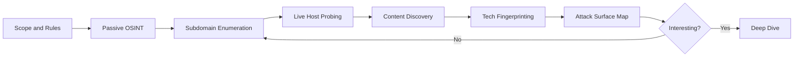

Every real engagement lives or dies in reconnaissance. Exploitation is fast and
loud; recon is slow, quiet, and where the actual thinking happens. If you know
the target's attack surface better than its own developers do, the exploit is
usually a formality.

<Alert variant="tip" title="Rule of thumb">
Spend **60–70%** of your time mapping the surface. A vulnerability you never
discovered is one you can never exploit — and the interesting bugs almost always
live on the forgotten subdomain, not the homepage.
</Alert>

## The recon workflow

We move from the least intrusive sources to the most, tightening the picture at
each step. Passive first, active only once you understand scope.



## Passive discovery

Passive recon never sends a packet to the target. You are reading what the rest
of the internet already knows: certificate transparency logs, DNS aggregators,
search-engine caches, and public code.

### Subdomain enumeration

The goal is breadth — every hostname that belongs to the target, including the
staging box someone forgot to firewall.

```bash
# Aggregate passive sources
subfinder -d target.tld -silent | tee subs.txt
amass enum -passive -d target.tld >> subs.txt

# De-duplicate, resolve, and probe which are actually alive
sort -u subs.txt | httpx -silent -title -tech-detect -status-code
```

<PayloadBox label="One-liner: live subdomains with tech + status" language="bash">
subfinder -d target.tld -silent | httpx -silent -td -sc -title
</PayloadBox>

### Where the good stuff hides

| Source | What you get | Why it matters |
| --- | --- | --- |
| crt.sh | Certificate transparency | Reveals internal + staging hostnames |
| Wayback Machine | Historical URLs & params | Dead endpoints often still work |
| GitHub / Gists | Leaked keys, internal URLs | Secrets in commit history |
| Shodan | Exposed services & banners | Non-web ports on the same ASN |

## Active discovery

Now you touch the target. Content discovery fuzzes for paths and parameters the
site never links to.

```bash
# Directory & file fuzzing
ffuf -u https://target.tld/FUZZ -w /wordlists/raft-medium.txt -mc 200,301,401,403

# Parameter mining on a specific endpoint
ffuf -u "https://target.tld/api?FUZZ=1" -w /wordlists/params.txt -fs 0
```

<Alert variant="warning" title="Stay in scope">
Content discovery generates thousands of requests. Confirm the rules of
engagement cover automated fuzzing and rate-limit yourself — a WAF ban mid-test
costs you the whole day.
</Alert>

## From data to a map

Raw lists are not recon. The deliverable is a **mental model**: which hosts run
which stack, where authentication boundaries sit, and which endpoints take
user-controlled input. That input is the thread you pull in the next chapter.

<DefenseNote title="Defender's view">
Recon is noisy and observable. Certificate transparency monitoring, DNS logging,
and alerting on bursts of `403`/`404` responses turn an attacker's mapping phase
into your **earliest** warning. Treat unexplained content-discovery scans as a
pre-incident signal, not background noise.
</DefenseNote>
