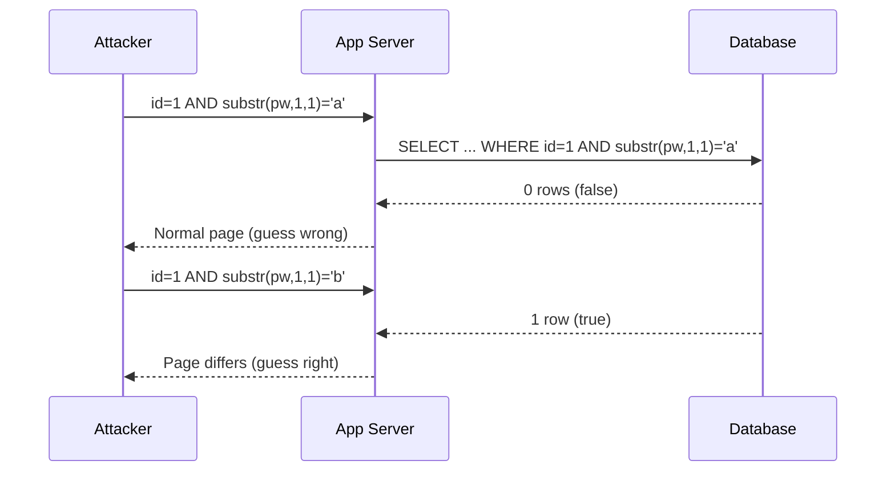

SQL injection happens when user input is concatenated into a query instead of
being passed as data. The database can't tell your `WHERE` clause from the
attacker's — so it runs both. Decades old, still in the OWASP Top 10, still
breaching real companies.

Real-world impact is not theoretical — the Accellion FTA mass-compromise rode a
critical SQL injection: <CVEBadge id="CVE-2021-27101" severity="critical" score={9.8} />

<Alert variant="danger" title="Only against systems you own or are authorized to test">
Everything here is for authorized assessments, lab environments, and CTFs.
Running these techniques against systems you don't have written permission to
test is a crime in most jurisdictions.
</Alert>

## The kill chain

The path from a reflected parameter to full application takeover is remarkably
short once the first quote breaks the query:

<AttackPath
  height={300}
  steps={[
    { id: "find", phase: "Recon", type: "recon", label: "Find a parameter", detail: "?id=1 reaches a query" },
    { id: "break", phase: "Detect", type: "entry", label: "Break the query", detail: "A single quote errors" },
    { id: "union", phase: "Exploit", type: "exploit", label: "UNION extraction", detail: "Dump the users table" },
    { id: "crack", phase: "Post", type: "privesc", label: "Crack the hashes", detail: "hashcat the password column" },
    { id: "own", phase: "Impact", type: "impact", label: "Login as admin", detail: "Full app takeover" }
  ]}
/>

## Step 1 — Detection

You are looking for input that changes the database's behavior. Start by
breaking the syntax, then prove you can control the logic.

<LabStep n={1} title="Baseline the normal response">
Request the endpoint with a legitimate value and record the status code,
response length, and any reflected content. Everything after this is measured
against that baseline.
</LabStep>

<LabStep n={2} title="Break the query">
Append a single quote and watch for a `500`, a database error string, or a
change in response length. An error is a gift — it often names the DBMS.
</LabStep>

<LabStep n={3} title="Confirm with boolean logic">
Prove control by toggling a condition true and false. Identical responses for
`true` and different responses for `false` confirm injection even with errors
suppressed.
</LabStep>

<PayloadBox label="Detection probes" language="sql">
1'
1' OR '1'='1
1' AND '1'='2
1 ORDER BY 1-- -
1 ORDER BY 99-- -
</PayloadBox>

## Step 2 — UNION-based extraction

Once you know the column count (from `ORDER BY`), a `UNION SELECT` lets you graft
your own result set onto the application's — pulling arbitrary data into the page.

```sql
-- Enumerate the schema
' UNION SELECT table_name, column_name FROM information_schema.columns-- -

-- Extract credentials
' UNION SELECT username, password FROM users-- -
```

<Alert variant="info" title="Match the column count and types">
`UNION` requires the same number of columns with compatible types. If a column
must be text, pad the others with `NULL`. `ORDER BY` from step 1 gave you the
count; now find which columns actually render.
</Alert>

## Step 3 — Blind injection

When nothing is reflected, you infer data one bit at a time by asking the
database yes/no questions and watching a side channel — the response, or the
clock.



Time-based blind trades the boolean tell for a delay — if the condition is true,
the query sleeps, and you read the answer off your stopwatch:

<PayloadBox label="Time-based blind (MySQL)" language="sql">
1' AND IF(substr((SELECT password FROM users LIMIT 1),1,1)='a', SLEEP(3), 0)-- -
</PayloadBox>

## Shutting it down

Every technique above collapses the moment input stops being treated as code.

<DefenseNote title="Fix the bug class, not the payload">
- **Parameterized queries / prepared statements** are the fix. The query
  structure is fixed; user input can only ever be a bound value.
- Input validation and allow-lists are defense in depth, **never** the primary
  control — a WAF blocks payloads you thought of, not the ones you didn't.
- Enforce least privilege on the database account: an app that only reads should
  not hold `DROP` or `FILE`.
</DefenseNote>

```python
# Vulnerable: string concatenation
cursor.execute("SELECT * FROM users WHERE id = " + user_id)

# Safe: the driver binds user_id as data, never as SQL
cursor.execute("SELECT * FROM users WHERE id = %s", (user_id,))
```
